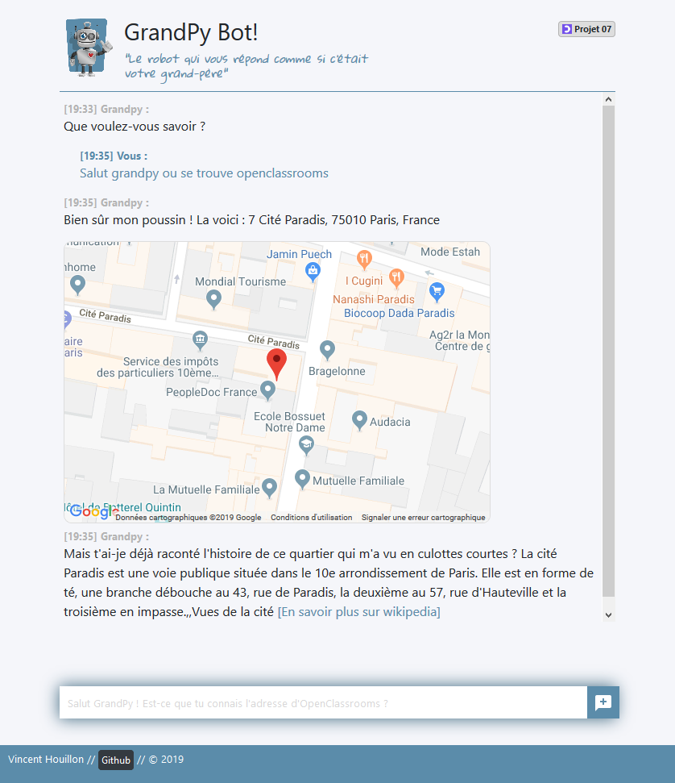
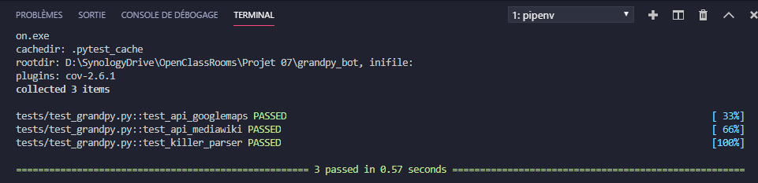

# GrandPy Bot

> OpenClassrooms // Application Developer Training - Python // Project 07

> [Link to the project Management Board](https://github.com/vincenthouillon/grandpy_bot/projects/1)

Ah, grandfathers ... I do not know you, but mine knew a lot of stories. It was enough for me to say a word to see him gone for hours. "Do you want the address of the post office? Oh yes, it's good, but I've already told you that I helped build it, it was in 1974 and ..." :sleeping:



## Getting Started

These instructions will get you a copy of the project up and running on your local machine for development and testing purposes.

### Prerequisites

```
Python 3.x
```

### Installing

Clone this repository to your local machine:
```
git clone https://github.com/vincenthouillon/grandpy_bot.git
```

### Example with '**pipenv**'

Go to the grandpy_bot folder:

```bash
cd grandpy_bot
```

Install dependencies in the virtual environment:

```python
pipenv install
```

To activate the virtual environment:
```python
pipenv shell
```

To launch the program with Windows:

```python
run.py
```

To launch the program with Unix system:

```python
python run.py
```

And open your browser to the following address '**localhost:5000**'.

Type '**exit**' to exit the virtual environment.

## Running the tests

Using '**pytest**':

### Installation

```bash
pip install pytest
```
Run tests:

```python
pytest -v
```



## Deployment

This project will have to be deployed on [Heroku]('https://www.heroku.com/').

## Built With

* [Python3](https://www.python.org/) - Python is a programming language that lets you work quickly and integrate systems more effectively.
* [Flask](http://flask.pocoo.org/) - Flask is a microframework for Python based on Werkzeug, Jinja 2 and good intentions.

## API Reference
* [API Google Maps](https://developers.google.com/maps/documentation/maps-static/intro)
* [API Media Wiki](https://pymediawiki.readthedocs.io/en/latest/quickstart.html#quickstart)

## Authors

* **Vincent Houillon** - *Initial work* - [vincenthouillon](https://github.com/vincenthouillon)

## License

This project is licensed under the WTFPL License - see the [LICENSE](LICENSE.md) file for details.

## Acknowledgments

* [OpenClassrooms](https://openclassrooms.com)

